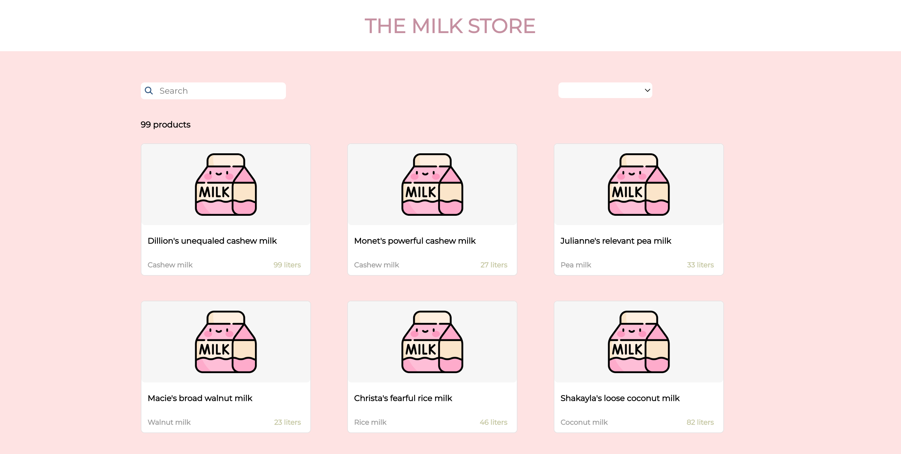

# Fullstack Milk Store app

## Background Info
If you've ever been to a grocery store in Sweden, you'd know that Sweden is the kingdom of milk. From regular to oat to coconut, every category of milk has its own different types! A local milk store has been getting a lot of business and needs a proper website to handle all the orders.

---
## Requirements
- all products on landing page
- a search bar
- a filter function
- pagination and 9 cards per page
- redirect to individual product*
- slider or input to order by liter*
- order button*  
*WIP
---
## Tech Stack and Getting Started
1. Backend: Express + TypeScript  
- cd server
- npm i
- npm run build
- npm start to run at http://localhost:8080/
  
2. Frontend: React + TypeScript 
- cd client 
- npm i  
- npm start to run at http://localhost:3000/
